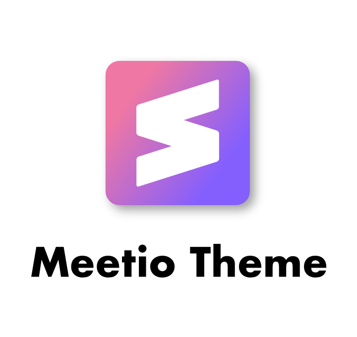

<p align="center"></p>

[](https://github.com/mauroreisvieira/meetio/releases)

[](https://github.com/mauroreisvieira/meetio/issues)
[](https://github.com/prettier/prettier)
[](https://github.com/mauroreisvieira/meetio/blob/master/LICENSE)

**Meetio** is the most powerful theme for Sublime Text 3 with different scheme variations only for 3176+ version.

**This theme is inspired upon the:**

* [Material Theme](https://github.com/equinusocio/material-theme) theme created by [@equinusocio](https://github.com/equinusocio).
* [cobalt2](https://github.com/wesbos/cobalt2) theme created by [@wesbos](https://github.com/wesbos).
* [DA UI](https://github.com/ihodev/sublime-da-ui) theme created by [@ihodev](https://github.com/ihodev).
* Icon resource from [Material Design](https://material.io/tools/icons/).
* Color resource from [Material Design](https://material.io/design/color/the-color-system.html#tools-for-picking-colors).

You can help improve the theme by reporting issues [here](https://github.com/mauroreisvieira/meetio/issues).

## Installation

**Package Control:**

1. Open `Command Palette` using menu item `Tools → Command Palette` or <kbd>cmd/ctrl</kbd> + <kbd>shift</kbd> +<kbd>p</kbd>
2. Choose `Package Control: Install Package`
3. Type `Meetio` and press <kbd>enter</kbd>
4. Restart Sublime Text
    * **macOS** : menu item `Sublime Text → Quit Sublime Text`
    * **Windows**: menu item `File → Exit`
    * **Linux** : menu item `File → Exit`
5. Ready to use 👍

**Manually:**

1. Download latest release and unzip. it into your Packages folder
2. Go to `Sublime Text → Preferences → Browse Packages`
3. Move folder to inside and rename the folder to `Meetio`
4. Restart Sublime Text
5. Start using 🏁


## Activate the theme

**You can active this theme from:**

1. Command Palette `Tools → Command Palette` or <kbd>cmd/ctrl</kbd> + <kbd>shift</kbd> + <kbd>p</kbd>
2. Typing `UI: Select Theme` next find for `Meetio` and press <kbd>enter</kbd>
3. Same process for scheme go to the Command Palette.
4. Typing `UI: Select Color Scheme` choose you favorite scheme and press <kbd>enter</kbd>

Manually you can go to (**Preferences > Settings - User**) and paste the following code:

```json
{
    "color_scheme": "Packages/Meetio/schemes/Meetio.sublime-color-scheme",
    "theme": "Meetio.sublime-theme"
}
```

### Theme Settings
This theme provide a visual configuration tool that allow you to configure the theme by activating the available options from an inline popup.

* Just click in `Sublime Text → Preferences → Packages Settings → Meetio → Edit Settings`.
* You can also open the settings from the Command Palette by searching `Meetio: Edit Settings`.

```json
{
    // Tabs
    "meetio_tabs_autowidth"       : true,  // Enable auto width for tabs
    "meetio_tabs_big"             : true,  // Set tabs big
    "meetio_tabs_bold"            : true,  // Make the tab labels bolder only in selected
    "meetio_tabs_selected_border" : true,  // Show border in selected tab
    "meetio_tabs_diff_icon"       : true,  // Show icon diff in tab
    "meetio_tabs_diff_highlight"  : false, // Show diff tab with different color

    // Sidebar
    "meetio_sidebar_font_big"     : true,  // Set large font in sidebar
    "meetio_compact_sidebar"      : true,  // Set compact sidebar
    "meetio_arrow_folders"        : true,  // Replace folder icons with arrows
    "meetio_sidebar_disclosure"   : true,  // Set disclosure tree controls

    // Panels
    "meetio_titlebar"             : true,  // Enable title bar (OS X 10.10+)
    "meetio_input_search_icon"    : true,  // Show icon search in inputs
}
```

### Theme Configuration
Meetio provides a bunch of variables to improve your experience with theming.

* Just click in `Sublime Text → Preferences → Packages Settings → Meetio → Theme Configuration`.
* You can also open the settings from the Command Palette by searching `Meetio: Theme Configuration`.

```json
{
    "variables": {
        "color_accent": "#6772e4",
        "status_bar_background_color": "#6772e4",
        "status_bar_label_foreground_color": "#fff"
    }
}
```

### Do you like Material Theme?
Active the option `meetio_tabs_selected_border` in `Meetio: Edit Settings` and past the following theme configurations in `Meetio: Theme Configuration` and the see magic happens.

```json
{
    "variables": {
        "input_border_color": ["foreground", 0.1],
        "input_border_size": [0, 0, 0, 1],
        "panel_control_background_color": ["background", 1.0],
        "sidebar_background_color": ["background", 1.0],
        "sidebar_icon_folder_color": "#607a86",
        "sidebar_icon_folder_color": "#607a86",
        "sidebar_label_foreground_color": "#607a86",
        "sidebar_label_selected_background_color": "#00000015",
        "sidebar_label_selected_foreground_color": "var(color_accent)",
        "status_bar_background_color": ["background", 1.0],
        "status_bar_label_foreground_color": "#607a86",
        "tabset_background_color": ["background", 1.0],
        "tabset_border_size": [0, 0, 0, 1],
        "title_bar_background": ["background", 1.0],
        "title_bar_foreground_color": "#607a86"
    }
}
```

### Recommended settings for a better experience:

```json
{
    "always_show_minimap_viewport" : true,
    "bold_folder_labels"           : true,
    "line_padding_bottom"          : 7,
    "line_padding_top"             : 7,
    "overlay_scroll_bars"          : "enabled",
    "highlight_modified_tabs"      : "enabled",
    "font_face"                    : "Fira Code"
}
```
