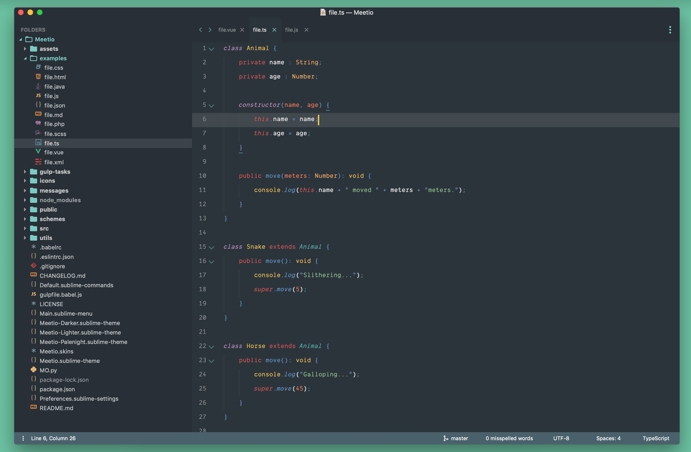
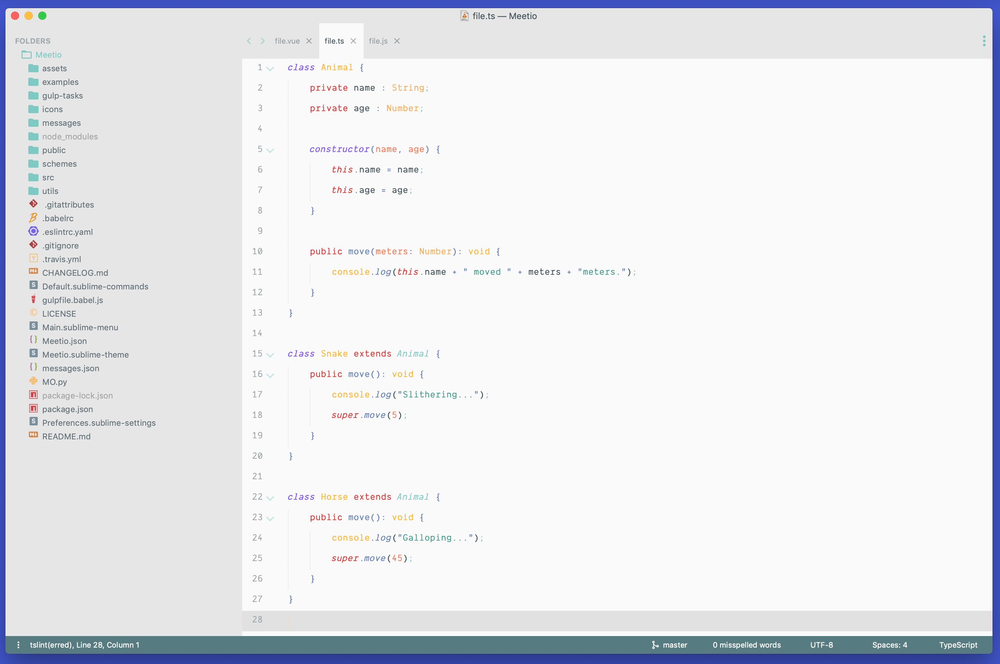
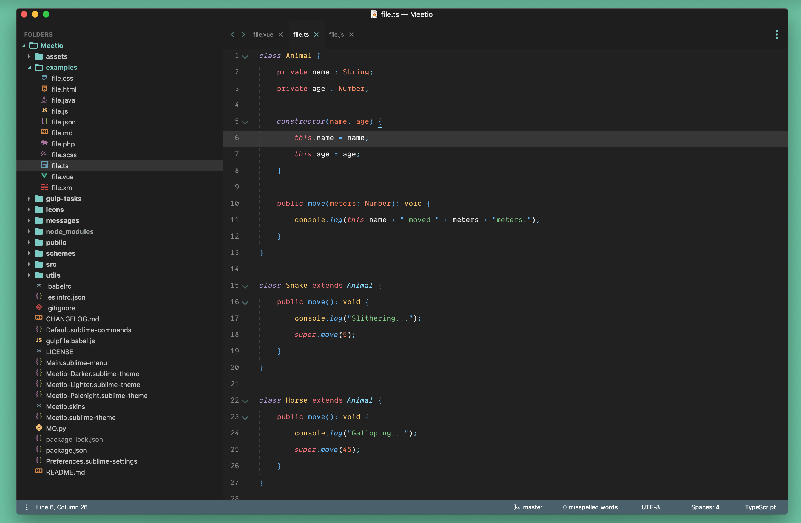
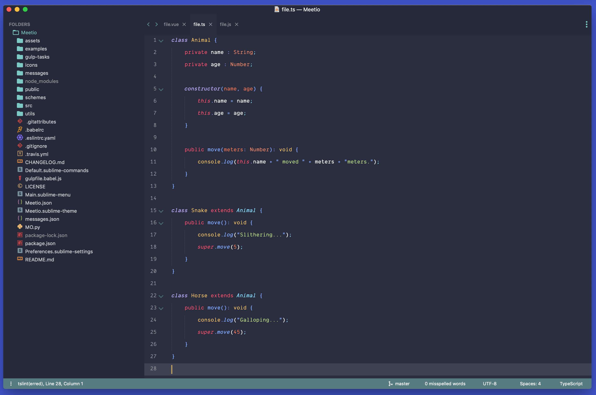
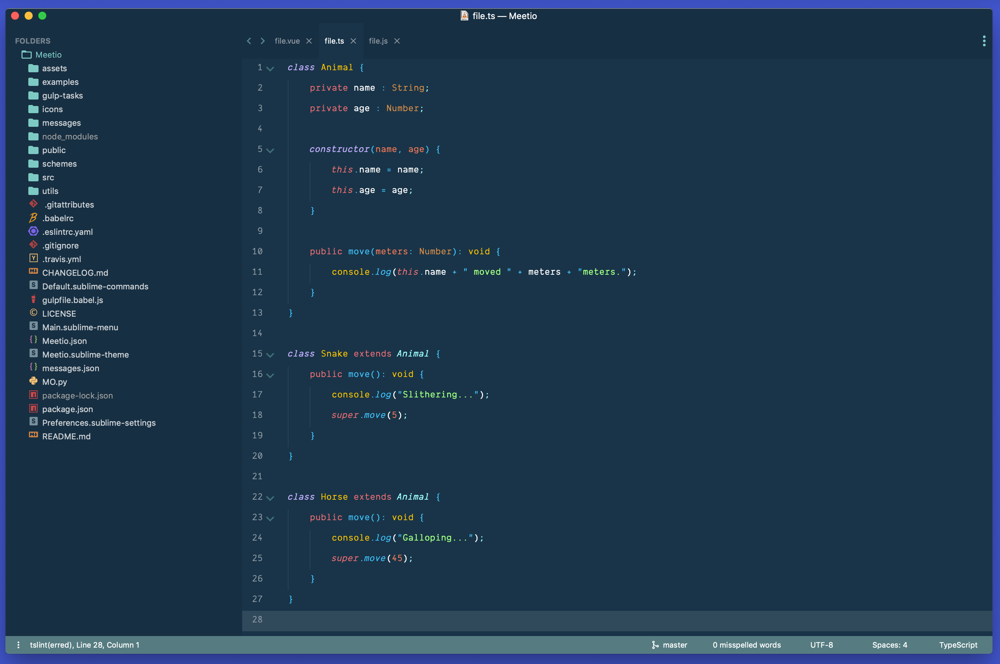

<p align="center"></p>

[](https://github.com/mauroreisvieira/meetio/releases)
[](https://travis-ci.org/mauroreisvieira/meetio)
[](https://github.com/mauroreisvieira/meetio/blob/master/LICENSE)

**Meetio** is the most powerful theme for Sublime Text 3 with different Scheme variations only for 3176+ version.

## Installation

**Package Control:**
 - Open `Command Palette` using menu item `Tools → Command Palette` or `(Ctrl or ⌘) + ⇧ + P`
 - Choose `Package Control: Install Package`
 - Type `Meetio` and press `Enter`
 - Restart Sublime Text
    - **macOS** : menu item `Sublime Text → Quit Sublime Text`
    - **Windows**: menu item `File → Exit`
    - **Linux** : menu item `File → Exit`

 - Ready to use 🎉

**Manually:**
 - Download latest release and unzip. it into your Packages folder
 - Go to `Sublime Text → Preferences → Browse Packages`
 - Move folder to inside and rename the folder to `Meetio`
 - Restart Sublime Text
 - Start using...


### Schemes variations

#### Meetio Default
<p align="center"></p>

```json
  "color_scheme": "Packages/Meetio/schemes/Meetio.sublime-color-scheme",
  "theme": "Meetio.sublime-theme",
```


#### Meetio Lighter
<p align="center"></p>

```json
  "color_scheme": "Packages/Meetio/schemes/Meetio-Lighter.sublime-color-scheme",
  "theme": "Meetio.sublime-theme",
```

#### Meetio Darker
<p align="center"></p>

```json
  "color_scheme": "Packages/Meetio/schemes/Meetio-Darker.sublime-color-scheme",
  "theme": "Meetio.sublime-theme",
```

#### Meetio Palenight
<p align="center"></p>

```json
  "color_scheme": "Packages/Meetio/schemes/Meetio-Palenight.sublime-color-scheme",
  "theme": "Meetio.sublime-theme",
```

#### Meetio Ocean
<p align="center"></p>

```json
  "color_scheme": "Packages/Meetio/schemes/Meetio-Ocean.sublime-color-scheme",
  "theme": "Meetio.sublime-theme",
```

### Theme Settings
This theme provide a visual configuration tool that allow you to configure the theme by activating the available options from an inline popup.\
Just click in `Sublime Text → Preferences → Packages Settings → Meetio → Edit Settings`.\
You can also open the settings from the command palette by searching `Meetio: Edit Settings`.

```json
  // Tabs
  "meetio_tabs_autowidth"    : true, // Enable auto width for tabs
  "meetio_tabs_big"          : true, // Set tabs big
  "meetio_tabs_bold"         : true, // Make the tab labels bolder only in selected
  "meetio_tabs_border"       : true, // Show border in selected tab

  // Sidebar
  "meetio_sidebar_font_big"  : true, // Set large font in sidebar
  "meetio_compact_sidebar"   : true, // Set compact sidebar
  "meetio_arrow_folders"     : true, // Replace folder icons with arrows
  "meetio_sidebar_disclosure": true, // Set disclosure tree controls

  // Panels
  "meetio_titlebar"          : true, // Enable title bar (OS X 10.10+)
  "meetio_input_search_icon" : true,  // Show icon search in inputs
  "meetio_statusbar_big"     : true  // Set status bar big
```

### Theme Configuration
Meetio provides a bunch of variables to improve your experience with theming.\
Just click in `Sublime Text → Preferences → Packages Settings → Meetio → Theme Configuration`.\
You can also open the settings from the command palette by searching `Meetio: Theme Configuration`.

```json
{
  "variables": {
    "color_accent": "#6772e4",
    "status_bar_background_color": "#6772e4",
    "status_bar_label_foreground_color": "#fff",
  }
}
```

### Do you like Material Theme?
Active the option `meetio_tabs_border` in `Meetio: Edit Settings` and past the following
options in `Meetio: Theme Configuration` and the magic happens.

```json
{
  "variables": {
    "input_border_color": ["foreground", 0.1],
    "input_border_size": [0, 0, 0, 1],
    "panel_control_background_color": ["background", 1.0],
    "sidebar_background_color": ["background", 1.0],
    "sidebar_icon_folder_color": "#607a86",
    "sidebar_icon_folder_color": "#607a86",
    "sidebar_label_foreground_color": "#607a86",
    "sidebar_label_selected_background_color": "#00000015",
    "sidebar_label_selected_foreground_color": "var(color_accent)",
    "status_bar_background_color": ["background", 1.0],
    "status_bar_label_foreground_color": "#607a86",
    "tabset_background_color": ["background", 1.0],
    "tabset_border_size": [0, 0, 0, 1],
    "title_bar_background": ["background", 1.0],
    "title_bar_foreground_color": "#607a86",
  }
}
```

### Recommended settings for a better experience:

```json
  "always_show_minimap_viewport" : true,
  "bold_folder_labels"           : true,
  "line_padding_bottom"          : 7,
  "line_padding_top"             : 7,
  "overlay_scroll_bars"          : "enabled",
  "highlight_modified_tabs"      : "enabled"
```
